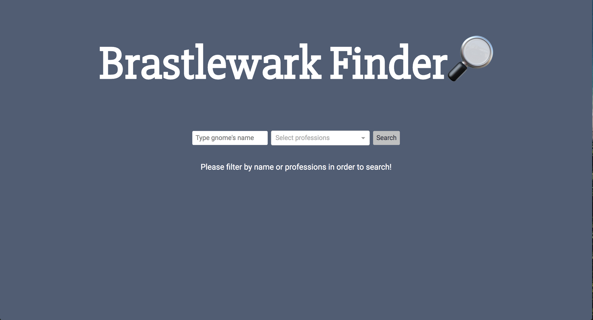
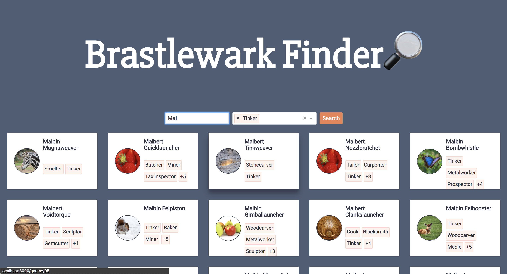

# Brastlewark Finder

[](https://github.com/prettier/prettier)
[](https://eslint.org/)
[](https://github.com/styled-components/styled-components)



> Web application that will allow you to search for gnomes inside the village of Brastlewark.

## Context

All the information of gnomes comes from a single endpoint, that will return the information of each gnome in the following structure:

```json
{
     "id": 0,
     "name": "Tobus Quickwhistle",
     "thumbnail":
    "http://www.publicdomainpictures.net/pictures/10000/nahled/thinking-monkey-11282237747K8xB.jpg",
     "age": 306,
     "weight": 39.065952,
     "height": 107.75835,
     "hair_color": "Pink",
     "professions": [
       "Metalworker",
       "Woodcarver",
       "Stonecarver",
       " Tinker",
       "Tailor",
       "Potter"
     ],
     "friends": ["Cogwitz Chillwidget", "Tinadette Chillbuster"]
   },
```

Given the lack of an approapiate REST API (all the information comes together, and that is the worst for the performance of the application), I divided the web application in two parts:

* Client: The React application itself, which has to provide an interface so the user can filter gnomes and also see all the information about them.
* Server: simple node server which starts an apollo-server that it's going to communicate the UI with the restless endpoint, leaving the work of handling the response of the API to this.

### Client

Communicate with the Server and provides a simple page which will help the user to find gnomes with a specific name or with different proffessions.



And if the user click on a gnome, a popup will be displayed showing all the information of it and having the ability to go and check his friends, just by clicking on them.


#### Technologies that runs here:

* react: UI library
* react-router: Routing
* redux: State manager
* apollo-client: Manage all the data request
* styled-components: Styling library
* jest: test-runner
* enzyme: testing util for testing component (shallow/mount)
* eslint: javascript linting
* pretiter: formatting

#### Project's structure

**Redux is organized using the [ducks structure](https://github.com/erikras/ducks-modular-redux) due to the complexity of the store, splitting each part of redux (actions, reducers, selectors, etc.) into different files will increase the boilerplate unnecesarily**

```
/src
├── ducks
│   └── search.js // Duck
├── screens
│   └── Home
│       └── components //components from this screen only
│       └── Container //Connection to redux
│       └── Home //Screen itself
│   └── Gnome // same structure from above
├── shared
│   └── components
│       └── Title.js
│       └── GnomeCard
│   └── constansts
│       └── theme.js
├── apolloClient.js // Apollo configuration
├── index.js // start of the application
├── store.js // Redux configuration
└── setupTests.js // Jest configuration for all the tests
```

### Server

Using Micro from Zeit, I'm hosting a GrahQL server using Apollo-GraphQL-Server, that will fetch the json from github and then give me a GraphQL endpoint so I can query it without having any problem!

So by doing this, all the request are going to be managed using Apollo, so we don't have to care of how the request is being performed just what information we need.

#### Project's structure

```
/server
├── index.js // entry of the server
├── server.js // Micro gets up the server and set the urls
├── query.js // All the queries to retrieve data from the endpoint
└── schema.js // type definitions and resolvers
```

---

### What can be improved in this project?

So this has started as an exercise that I had to submit, but as I was adding new technology (like Apollo), I set aside some importants things:

* **Achieving a decent amount of code coverage:** this project has some test done, for example all the component inside shared folder are tested and also the Home Screen too. But there are few more files that don't have any test file, so that will be the first problem to attack.
* **Doing more than just Unit test:** I had done only Unit testing, and in most application this kind of testing is pretty short, the reliability of them are bad in opinion comparing to Integration test and end to end test. So this point is very important too.
* **Set an CI process:** this will help to detect when a commit has broken the build (some test failed or there is a linter error). Travis is a good option here!
